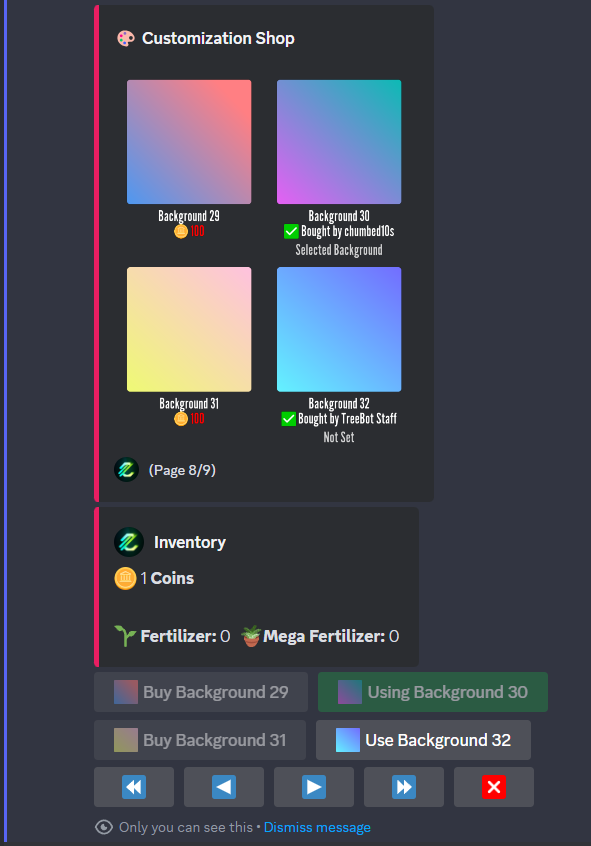
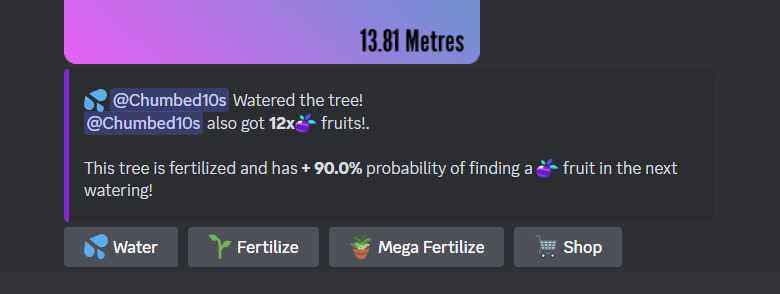

# Changelog Since 0.2.0

## 🛒 [0.2.0] The shop update

### TLDR

- 🎨 Customization shop completely redesigned
- 👤 User Profiles
- 🍎 Fruits rates
- ⌛ Per server Cooldown
- 🔒 Administration systems got better
- 🪴 Fertilizer now last longer
- 🌲 Fertilizer grow rate changed
- 🍎 Now fruit earning are public
- 🪲 Bug fixes

---

### 🎨 Customization shop completely redesigned

With this update, you can now view four backgrounds per page, making it easier to browse the shop and find exactly what you're looking for. This enhancement reduces the total number of background pages from `36` to just `9`, streamlining your shopping experience.

#### 0.1.x Shop

#### 0.2.0 Shop

As well, you can see below every background the actual price, or if the background was already bought by you or another user, it will say `Bought by <user>` (User can also be replaced with `Treebot` for the default background or `TreeBot Staff` if it was given through admininstation commands, because of a bug or a giveaway, why not).

### 👤 User Profiles

Did you ever want to see your inventory without opening the shop?
It is now possible with `/profile`!
You can see your own profile by leaving the `user` field empty or fill it with an user to see the profile of that user. And as we know you want to show those amazing 6 coins you got from a fruit, you can set the `public` field to `Yes` so other users can see your amazing progress on the server and globally.

Wait... Server progress?
Yes, Since the `0.1.0`, Treebot was saving how many times you watered the tree, how many times you fertilized the tree, how many times you mega fertilized the tree, how many fruits you got and the background you have bought. Well, it is now possible to see with `/profile`

### 🍎 Fruits rates

Fruit Rates have been implemeted, now, you will get a certain amount of fruits depending on how long the tree is. Before this was always a certain possibility to get **1** fruit, now you have that possibility to get more fruit depending on the height.

*Note: Fertilizers will make the fruits have more probabilities to appear, but does not gives you more fruits.*

### ⌛ Per server Cooldown

Have you ever tried to water two different servers' trees at the same time and got a cooldown message? Now you can water as many server trees as you want at the same time!
*This change does not modify the cooldown time, it just separates your cooldown time from the other servers.*

### 🔒 Administration systems got better

This is not an update that users can see directly, but with this we (TreeBot Staff) can manage user/server profiles way easier, making it better for everyone as staff will be able to solve any problem user might have.

### 🪴 Fertilizer now last longer

Before, the fertilizer and the mega fertilizer would only rise the tree boost for the next watering and nothing more. To make it more considerate with other users, the boost of the tree will get reduced 10% by each watering, so, if my tree has 30% boost, it will last 3 waterings
30% -> 20% -> 10% -> 0%

### 🌲 Fertilizer grow rate changed

Fertilizers had a fixed metres grow value, now it depends on the boost.
*For example, if the boost is 40%, the tree will grow by 4 + (40 - 30) / 10 * 3 = 7*

*4 (boost-30)/10\*3)*

### 🍎 Now fruit earning are public

When you watered a tree and got a fruit, nobody could see that amazing fruit you got, so now evryone can see what you got on the watering message! (Tree message or the notification channels)

#### Tree Message

> Note: it's not possible to get 90% boost, it was only for showcasing

#### Notification channel

### 🪲 Bug fixes

Some bug fixes :D

## [0.2.2] Bug fixes

### Help command was not searching

The `/help` command was not searching for the command you wanted to know information about. Looks like it was blocking all command descriptions as "admin commands" and admin commands aren't shown in the help command. All of this was now fixed!

### Multi-Language help command searching

You couldn't only search help for commands with the default command language (English) now, this works with Spanish as well and will work with more languages in the future, if additional languages are added.

### Commands translation not displaying

- Water
- Fertilize
- Mega Fertilize

All those commands were not displaying their translation on the discord client.

## [0.2.3] Vote rewards

### Included vote rewards

As you read! you can now vote for TreeBot on [Top.gg](https://top.gg/bot/1169844816176230480/vote) and [DiscordBotList](https://discordbotlist.com/bots/treebot-1943/upvote) to get **5x 🪴 Mega Fertilizers**, just for voting!

And of course, the `/vote` command was added so you can access the vote links easily.

> [!NOTE]
> While Top.gg notifies TreeBot instantly about your vote, DiscordBotList can take up to an hour to notify TreeBot. As a result, you will need to wait at least an hour to get the reward for DiscordBotList.

### Some bug fixes

- Updated the library that interact with discord to the latest, fixing some bugs with failed interactions
- `/profile` was showing *"Not Translated (BACKGROUND.BACKGROUND-XX.NAME)"* because of an update with how Background language codes are managed.
- Some other small fixes
 