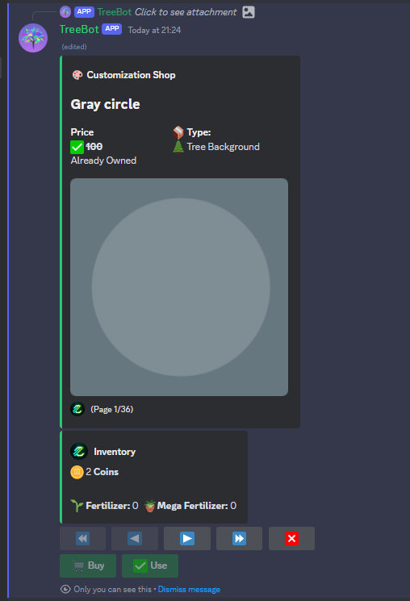
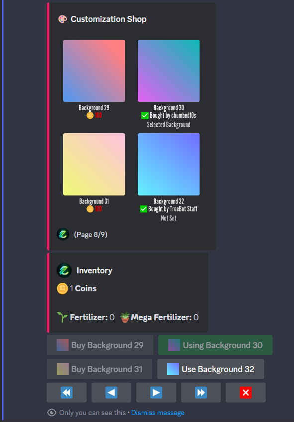
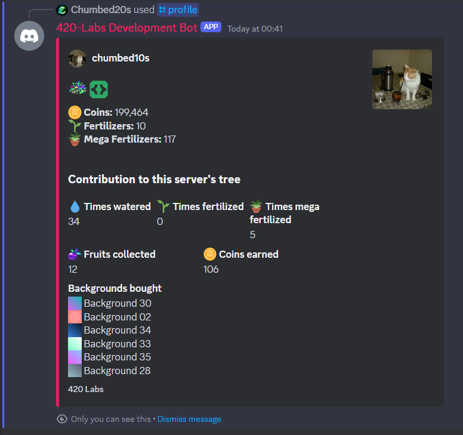
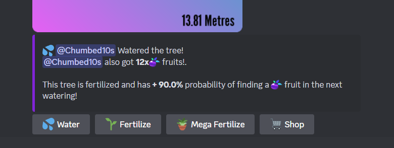
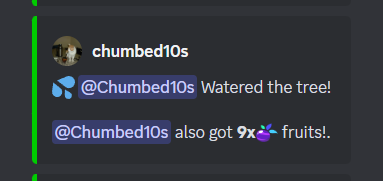

# Registro de cambios desde 0.2.0

## 🛒 [0.2.0] La actualización de la tienda

### MLNL (TL;DR)

- 🎨 Tienda de personalización rediseñada completamente
- 👤 Perfiles de usuario
- 🍎 Ratios de frutas
- ⌛ Cooldown por server
- 🔒 Sistemas de administración mejorados
- 🪴 Fertilizantes duran más tiempo
- 🌲 El ratio de crecimiento de los fertilizantes fue cambiado
- 🍎 Las frutas que consigas ahora son mostradas publicamente
- 🪲 Arreglos de Bugs

---

### 🎨 Tienda de personalización rediseñada completamente

Con esta actualización, ahora puedes ver cuatro fondos por página, lo que facilita navegar por la tienda y encontrar exactamente lo que estás buscando. Esta mejora reduce el número total de páginas de fondos de `36` a solo `9`, simplificando tu experiencia de compra.

#### Tienda 0.1.x

#### Tienda 0.2.0

Además, debajo de cada fondo puedes ver el precio actual, o si el fondo ya fue comprado por ti u otro usuario, dirá `Comprado por <usuario>` (El usuario también puede ser reemplazado por `Treebot` para el fondo predeterminado o `Staff de TreeBot` si fue otorgado a través de comandos de administración, debido a un error o un sorteo, ¿por qué no?).

### 👤 Perfiles de Usuario

¿Alguna vez quisiste ver tu inventario sin abrir la tienda?
¡Ahora es posible con `/perfil`!
Puedes ver tu propio perfil dejando el campo `usuario` vacío o llenándolo con un usuario para ver el perfil de ese usuario. Y como sabemos que quieres mostrar esas increíbles 6 monedas que obtuviste de una fruta, puedes establecer el campo `público` en `Sí` para que otros usuarios puedan ver tu increíble progreso en el servidor y a nivel global.

Espera... ¿Progreso en el servidor?
Sí, desde la versión `0.1.0`, Treebot estaba guardando cuántas veces regaste el árbol, cuántas veces fertilizaste el árbol, cuántas veces mega fertilizaste el árbol, cuántas frutas obtuviste y el fondo que compraste. Bueno, ahora es posible verlo con `/perfil`.

### 🍎 Tasas de Frutas

Las Tasas de Frutas han sido implementadas, ahora, obtendrás una cantidad determinada de frutas dependiendo de la altura del árbol. Antes, siempre había una posibilidad de obtener **1** fruta, ahora tienes la posibilidad de obtener más frutas dependiendo de la altura.

*Nota: Los fertilizantes harán que las frutas tengan más probabilidades de aparecer, pero no te darán más frutas.*

### ⌛ Cooldown por Servidor

¿Alguna vez intentaste regar los árboles de dos servidores diferentes al mismo tiempo y recibiste un mensaje de cooldown? ¡Ahora puedes regar tantos árboles de servidor como desees al mismo tiempo!
*Este cambio no modifica el tiempo de cooldown, simplemente separa tu tiempo de cooldown de los otros servidores.*

### 🔒 Mejoras en los sistemas de administración

Esta no es una actualización que los usuarios puedan ver directamente, pero con esto nosotros (el Personal de TreeBot) podemos gestionar los perfiles de usuario/servidor de una manera mucho más fácil, lo que beneficiará a todos ya que el personal podrá resolver cualquier problema que los usuarios puedan tener.

### 🪴 Ahora el fertilizante dura más

Antes, el fertilizante y el mega fertilizante solo aumentaban el impulso del árbol para el próximo riego y nada más. Para ser más considerados con otros usuarios, el impulso del árbol se reducirá un 10% con cada riego, así que, si mi árbol tiene un impulso del 30%, durará 3 riegos
30% -> 20% -> 10% -> 0%

### 🌲 Cambio en la Tasa de Crecimiento del Fertilizante

Los fertilizantes tenían un valor de crecimiento fijo en metros, ahora depende del impulso.
*Por ejemplo, si el impulso es del 40%, el árbol crecerá en 4 + (40 - 30) / 10 * 3 = 7*

*(4 (impulso-30)/10\*3)*

### 🍎 Ahora las ganancias de frutas son públicas

Cuando regabas un árbol y obtenías una fruta, nadie podía ver esa increíble fruta que conseguiste, ¡así que ahora todos pueden ver lo que obtuviste en el mensaje de riego! (Mensaje del árbol o los canales de notificación)

#### Mensaje del árbol

> Nota: No es posible obtener 90% de boost, solo para muestra

#### Canal de notificaciones

### 🪲 Arreglo de bugs

Algunas correcciones de errores :D

*¿Realmente leíste todo? Reacciona con un 🦑 en el mensaje de anuncio si lo hiciste*
